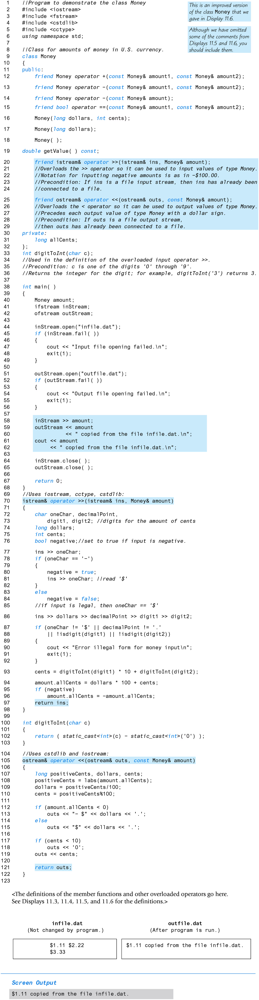
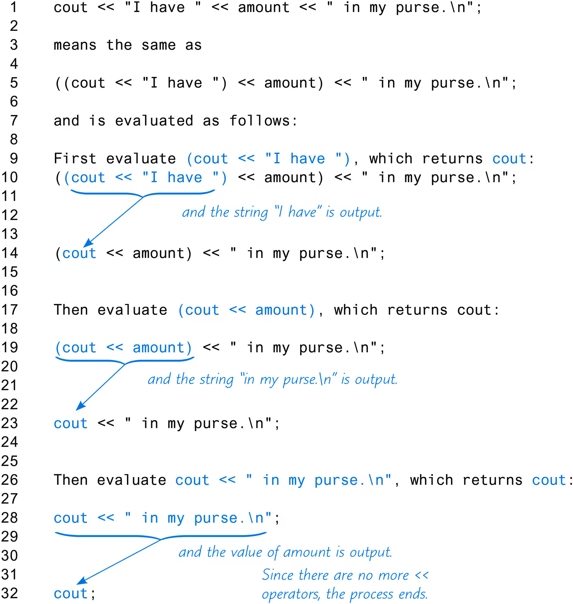
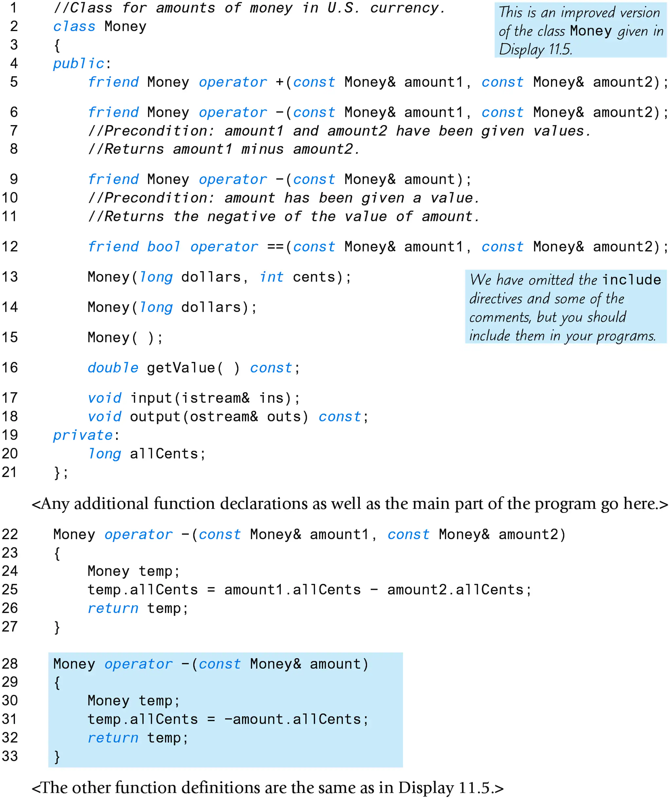
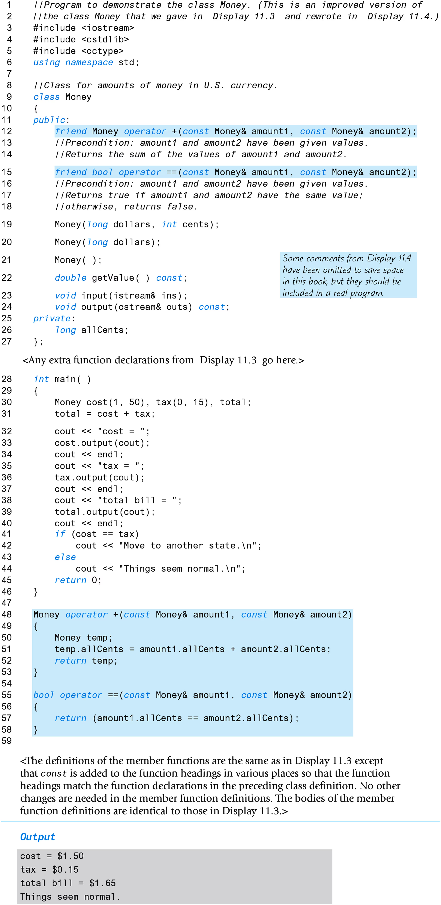
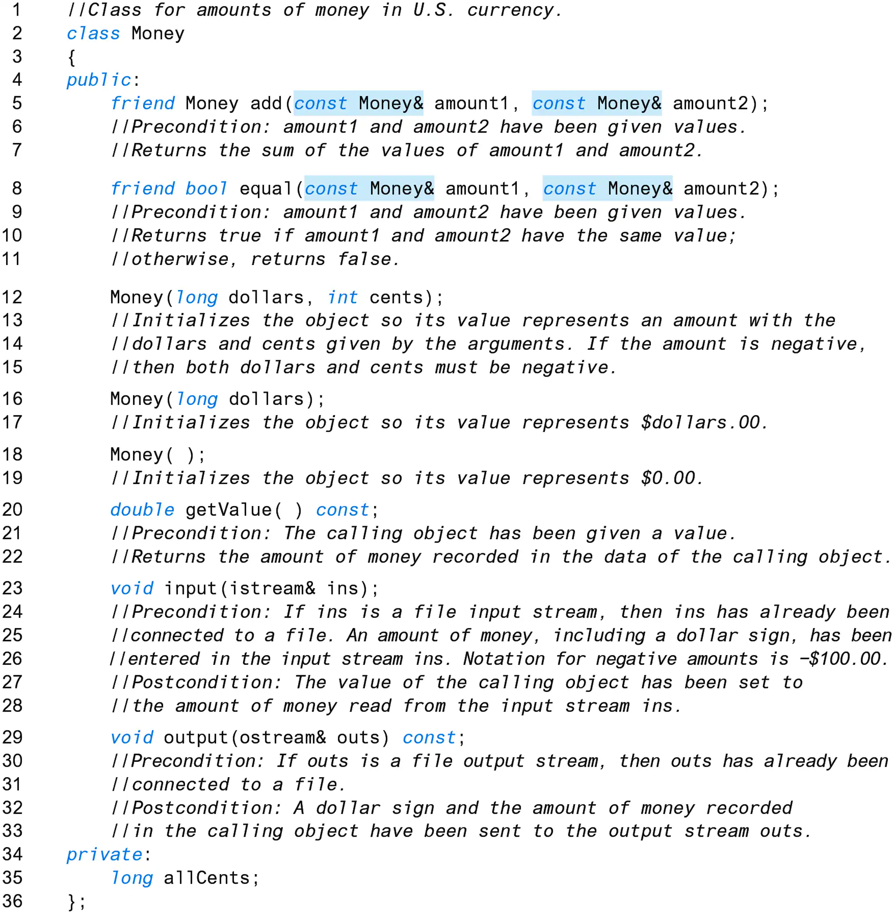
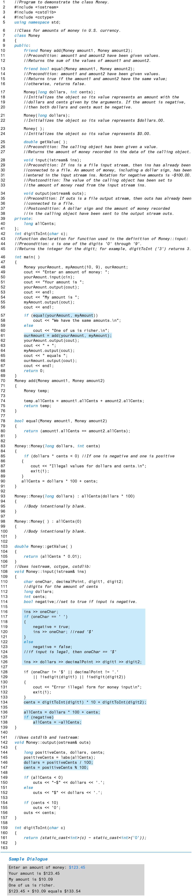

Complete Practice Program #3 on page 738. You may watch
video notes on this. However, no sample code is given
for this project, as the main intent of the projects is
for the student to create a "project" on their own. You
are to rework Practice Program #1 from Chapter 1, page 695.
You modify the money class from Display 11.8 adding the
following:

- operators: <, <=, >, >=
- add member function `Percent(int percentFigure) const`;
returns a percentage of the money amount in the calling
object. If `purse` is a `Money` object whose value is $900.00
and `percentFigure` is 10, you return $90.00, 10 percent
of $900.00

Submit three files:
- YourLastNameFirstNameInitialMoney.cpp - This file
contains only the `Money` class implementation
- YourLastNameFirstNameInitialProj4.cpp - This file
contains only the main function to use/test your
money class
- YourLastNameFirstNameInitialMoney.h - This file
contains the header file information.

Please upload the 3 files seperately on the Project 4 link.
If you have issues uploading them separately, you can zip
them into one and upload. The name of the zip file should
be YourLastNameFirstNameInitialProj4.zip. The files
contained in the zip file must be named as above.

Also, please don't use any obscure zip format that I might
not have heard of. If I have to research extensively just
to unzip your file ... I mean, you don't want me *annoyed* when I'm grading your project, do you? :-)

Due date: 11:59pm - 10/05/2024

---

# Display 11.8

---

# Display 11.7

---

# Display 11.6

---

# Display 11.5

---

# Display 11.4

---

# Display 11.3
